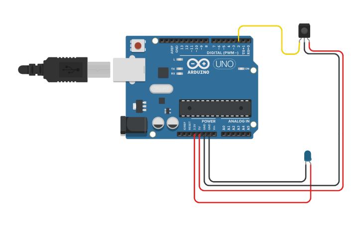

# Fidget Spinner Tester #
There are lots of fidget spinners around at the moment and some are better than others. This gadget uses an Arduino Uno and a infrared LED and sensor to test how good a particular spinner is.

## What you'll need ##
An [Arduino UNO](https://store.arduino.cc/arduino-uno-rev3)
A [infrared break beam sensor kit](https://www.adafruit.com/product/2167)
Optionally a Display 

## Connecting it up  ##

## The Software ## 
There are two versions of the code...

**Version 1 : PulseLength_period_v2**
This version prints out the Revs Per Second (RPS) every 5 seconds when a spinner is breaking the beam and the maximum RPS and spin down time when it stops seeing a spinner.

**Version 2 : PulseLength_period_displayv2**
For the second version of the software we used an OLED display and the fantastic [u8g2](https://github.com/olikraus/u8g2) library. We could tell you how ours is connected but there are so many different versions of the these displays out there the chances are yours will be different. If in doubt, buy your display from somewhere that tells you how to connect it up and use it (our favourite shops are [Pimoroni](https://shop.pimoroni.com/ "Pimoroni") and [Adafruit](https://www.adafruit.com/))  

# The Theory #
## What's tested? ##
We look at two aspects of how good a particular spinner is.
1. How fast can it spin
2. How long does it take to slow down.

## How do we measure speed ##
We can use the infrared LED to shine and invisible beam of light at the sensor. This will cause the sensor output to be high unless the beam is broken by the leg of a spinner passing it when it will go low. 

To tell how fast its spinning, we use the **[attachInterrupt](https://www.arduino.cc/en/Reference/AttachInterrupt "attachInterrupt")** statement arrange for the Arduino to stop what it's doing whenever it sees a low on the sensor pin. In the interrupt function **ISRPulse()** (normally called an interrupt service routine or ISR) we save the current value of a special counter called micros in an array.   

As the micros counter gets one added to it every microsecond (uS), when we have been interrupted twice we have the time in microseconds it took between two spinner legs passing by. What we really want though is the frequency with which the legs are passing. The formula that relates time to frequency is **Frequency = 1 / Time** so if we divide 1 by our time we get the frequency of the legs.

**Except....** there are a couple of problems here though... 

1. The time we have is in microseconds and the formula expects it to be in seconds. So we don't have to deal with a large number (something which micro controllers struggle with), rather than multiplying our time by 1000000 then dividing 1 by that number, we divide 1000000 by our number.
2. The number we get is how frequently a leg passes by. This would give us the right number if all spinners had only one leg. To get the correct answer, we *assume* the spinner has three legs and divide the answer by 3. Perhaps you can modify the code to enter the number of legs.

The rest of the code deals with deciding when there is a spinner present, counting how long its been spinning and when to print out the results.     
 
#License#

 This work is licensed under a <a rel="license" href="http://creativecommons.org/licenses/by-sa/4.0/">Creative Commons Attribution-ShareAlike 4.0 International License</a>.

Based on an original piece by [2.Times Do CIC](http://2timesdo.co.uk "2.Times Do CIC ") at [https://github.com/2timesdo/FidgetSpinner](https://github.com/2timesdo/FidgetSpinner "https://github.com/2timesdo/FidgetSpinner")